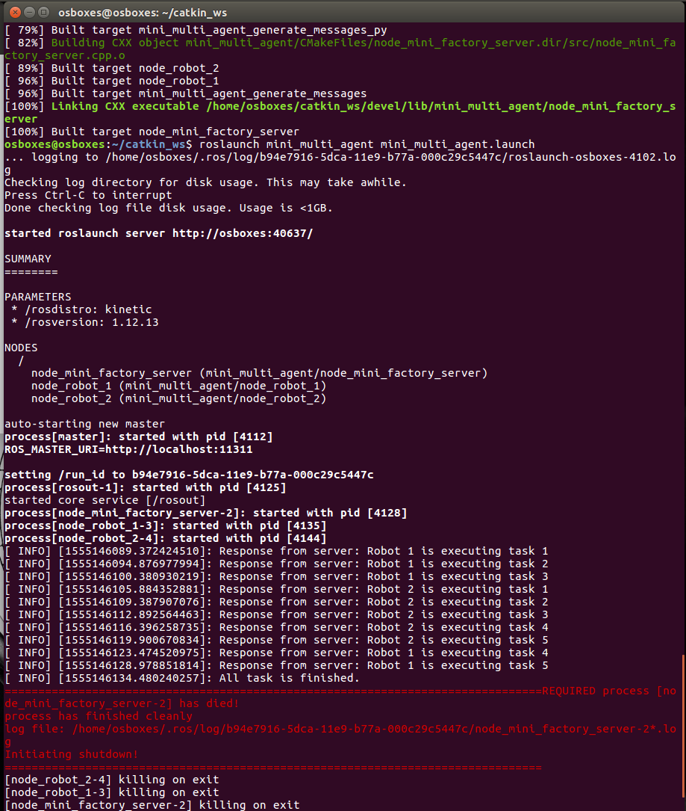

# Mini Multi Agent System

a mini multi agent system by using roscpp

## 使用

如果ros环境默认在catkin_ws文件夹下，则将包放置在catkin_ws/src中，然后在catkin_ws文件夹下编译：

    $ catkin_make
    $ source devel/setup.bash 
    $ rospack find mini_multi_agent
    $ roslaunch mini_multi_agent mini_multi_agent.launch

## 运行结果

## 描述

 1.创建可编辑的ROS包

 2.在第一个ROS节点中，将其命名为node_mini_factory_server，创建一个ROS主题订户（主题名称“/ agent_feedback”）以接收代理反馈信息。 

 3.在第二个ROS节点中，将其命名为node_robot_1，创建一个ROS服务服务器（主题名称“/agent_task_1”）以从mini_factory_server接收任务。在node_mini_factory服务器ROS节点中，创建ROS服务客户端（topic名称"/agent_task_1“）以发送代理任务信息。

4.在第三个ROS节点中，将其命名为node_robot_2，同上，服务名称为“/ agent_task_2”以从mini_factory_server接收任务。在node_mini_factory_server的ROS节点中，创建ROS服务客户端（topic名称“/ agent_task_2”）以发送代理任务信息。

 5.使用至少2个状态实现node_robot_1。启动时，节点处于“ready”状态。从node_mini_factory_server接收任务后，它将转换为“executing”状态。大约5秒后，机器人从“executing”转换为“ready”。

 6.使用至少2个状态实现node_robot 2。启动时，节点处于“ready”状态。从node_mini_factory_server接收任务后，它将转换为“executing”状态。大约3秒后，节点从“executing”转换到“ready”。 

7  使用标识为id = 1,2,3,4,5的5个初始任务实现node_mini_ factory_server：node_mini_factory_server将在收到来自“/agent_feedback”机器人节点反馈后知道有2个机器人节点及其状态。
 如果该节点处于“ready”状态，则node_mini_factory_server应该将任务发送给该节点。请注意node_mini_factory_ server应该一次只向一个发送一个任务。当机器人节点完成任务（状态从“executing”转换为“ready”）时，如果不是所有5个任务都完成，则node_mini_factory_server应该向该节点发送另一个任务。 

 8.创建ROS消息“/agent_feedback”和ROS服务“agent_task_x”（x = 1,2）以满足上述需求。

 9.创建一个roslaunch，将启动前面提到的所有三个节点，结果应清晰地打印到屏幕上。结果应显示每个机器人状态，哪个工厂任务已完成或待处理等。

## 需改进

1. Robot重新定义复制初始化函数的接口
2. task_scheduler优化（添加内置的timer）
